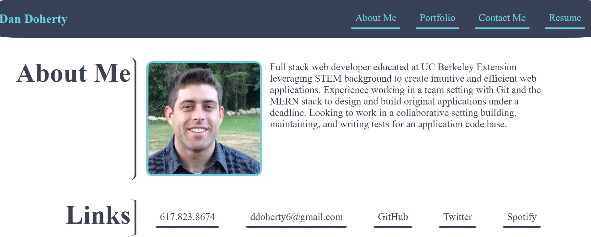

# Dan Doherty's Portfolio

Please find this portfolio [deployed](https://ddoherty6.github.io/portfolio/) on GitHub pages.

## Build

This page is built using ReactJS. It includes conditional JSX rendering.

### Future Development

The next step for this page is to improve the styling from the ground up, most likely employing Materialize to acheive a clean look. After that, it will be important to get the contact form functional on the backend, and improve the UX on it. 

## Collaboration

If you would like to work on a given project, please reach out to me at ddoherty6@gmail.com